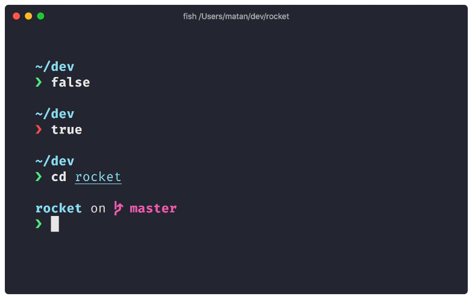

.. highlight:: console

.. author:: Michi <https://github.com/michi-zuri>
.. author:: Mike <https://github.com/fooforge>

.. tag:: console
.. tag:: lang-rust

.. sidebar:: Logo

  .. image:: _static/images/starship.svg
      :align: center

########
Starship
########

.. tag_list::

Starship_ is the minimal, blazing-fast, and infinitely customisable prompt for
any shell!

----

.. note:: For this guide you should be familiar with the basic concepts of

  * :manual:`shell <basics-shell>`

License
=======

Starship_ is free software, available under the permissive ISC License, which
is functionally equivalent to BSD 2-Clause and MIT licenses,
removing some language that is no longer necessary.

Prerequisites
=============

A `Nerd Font`_ installed and enabled in your terminal on your computer (for example, try the
FiraCode Nerd Font that can be downloaded from NerdFonts_).

Instructions for installing fonts depend on your local operating systems: `Windows 10`_,
macOS_. For Linux: read the manual that belongs to your distribution. Blink.sh_ should
work out of the box.

Installation
============

To install the prebuilt binary you need to curl the install script from the project's
website. Once installed, you can execute Starship_ to update your current shell's prompt.

.. code-block:: console

 [isabell@stardust ~]$ sh -c "$(curl -fsSL https://starship.rs/install.sh)" -- --bin-dir ~/bin --yes
 [...]
 [isabell@stardust ~]$ eval "$(~/bin/starship init bash)"
 isabell on stardust in ~

Piping install scripts into a shell can be dangerous! Less so on a virtual host with
non-elevated user rights, but still. To review the install script before any action is being taken
you can run the above command like below. This will open your default editor. If anything looks
suspicious, to abort the installation you would need to remove the file's content and save your changes.

.. code-block:: console

 [isabell@stardust ~]$ curl -fsSL https://starship.rs/install.sh | vipe | sh -s -- --bin-dir ~/bin --yes
 [...]
 [isabell@stardust ~]$ eval "$(starship init bash)"
 isabell on stardust in ~

To make the prompt permanent, add a newline and the below eval statement to your ``~/.bashrc``:

.. code-block:: console

 eval "$(~/bin/starship init bash)"

That's it, you have successfully installed Starship_ to your Uberspace console:

.. code-block:: console

 [isabell@localhost ~]$ ssh isabell@stardust
 Welcome to Uberspace7!
 [...]
 isabell on stardust in ~

To start customizing your prompt, have a look at `Starship's Presets`_'. The configuration file lives
in ``~/.config/starship.toml``.

.. _Starship: https://starship.rs/
.. _`Starship's Presets`: https://starship.rs/presets/#presets
.. _`Nerd Font`: https://www.nerdfonts.com/
.. _NerdFonts: https://www.nerdfonts.com/font-downloads
.. _`Windows 10`: https://support.microsoft.com/en-us/help/314960/how-to-install-or-remove-a-font-in-windows
.. _macOS: https://support.apple.com/en-us/HT201749
.. _blink.sh: https://blink.sh/

Tested with Starship v1.2.1 and Uberspace version 7.12.

.. author_list::
