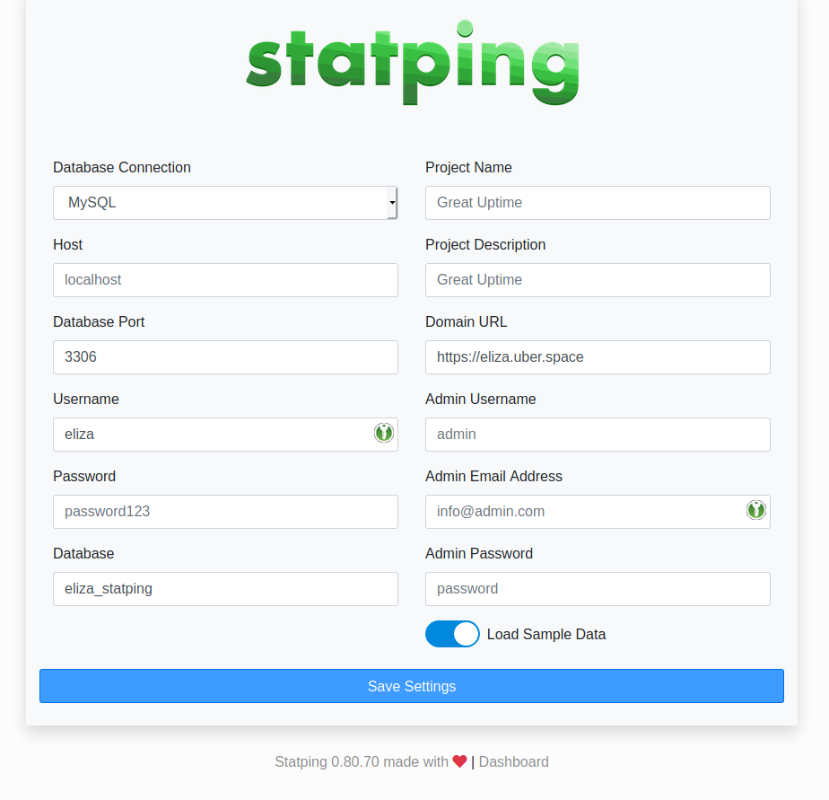

.. author:: Moanos <https://hyteck.de/about/>

.. tag:: monitoring
.. tag:: web
.. tag:: self-hosting
.. tag:: prometheus
.. tag:: lang-go
.. tag:: audience-admins

.. highlight:: console

.. sidebar:: Logo

  .. image:: _static/images/statping.png
      :align: center

########
Statping
########

.. tag_list::

`Statping`_ is a lightweight and easy to install monitoring tool written in Go.
It is published under the GNU General Public License v3.0.

----

.. note:: For this guide you need some tools:

  * :manual:`web backends <web-backends>`
  * :manual:`supervisord <daemons-supervisord>`

Prerequisites
=============

.. include:: includes/my-print-defaults.rst

Create a directory for the configuration.

::

  [isabell@stardust ~]$ mkdir ~/statping

Create a database

::

  [isabell@stardust ~]$ mysql -e "CREATE DATABASE ${USER}_statping"

Installation
============

Now let's get started with installing Statping .

Start with cloning the Statping binaries from Github_ and be sure to replace the version ``v0.80.70`` with the current release number!:

::

 [isabell@stardust ~]$ cd statping
 [isabell@stardust statping]$ curl -sL https://github.com/statping/statping/releases/download/v0.80.70/statping-linux-x64.tar.gz | tar xz
 [isabell@stardust statping]$ ls
 statping  statping.asc

You can now verify the GPG signature in statping.asc

Setup daemon
------------

Create ``~/etc/services.d/statping.ini`` with the following content:

.. code-block:: ini

   [program:statping]
   directory=%(ENV_HOME)s/statping/
   command=%(ENV_HOME)s/statping/statping
   autostart=yes
   autorestart=yes

.. include:: includes/supervisord.rst

Configure web server
--------------------

.. note::

    Statping is running on port 8080.

.. include:: includes/web-backend.rst

Configuration
=============

You can now access Statping via your browser by visiting <username>.uber.space or any domain
you set up.

.. _fig_statping_config:

   Configuration site of statping.

Select the Database Connection :manual:`MYSQL <database-mysql>`  and type in your your username and password.
The database runs on localhost, the port is 3306.

Also add a Project Name and add your domain <username>.uber.space or any other domain you want to
use to reach statping.

Add your E-Mail Address and set a password, then you are good to go. No worries if it takes up to
one minute to process your request after clicking :guilabel:`Save Settings`.

Customization
=============

To configure your dashboard, manage alerts and much more visit yourdomain.tld/dashboard. Log in with
the admin account you created. For help an this you should have a look at the `Statping Wiki`_.

Updates
=======

.. note:: Check the update feed_ regularly to stay informed about the newest version.

If there is a new version available, you can get the binary with the same command. First you stop the server, then get the new binary. Make sure to replace the version number ``v0.80.70`` with the latest version number you got from the release feed_. Now start the service again and check if everything works fine!

.. code-block:: console

   [isabell@stardust ~]$ cd ~/statping/
   [isabell@stardust statping]$ supervisorctl stop statping
   [isabell@stardust statping]$ curl -sL https://github.com/statping/statping/releases/download/v0.80.70/statping-linux-x64.tar.gz | tar xz
   [isabell@stardust statping]$ supervisorctl start statping

.. _Github: https://github.com/statping/statping/
.. _feed: https://github.com/statping/statping/releases
.. _`Statping Wiki`: https://github.com/statping/statping/wiki

----

Tested with Statping v0.80.70 and Uberspace 7.2.4.0

.. author_list::
