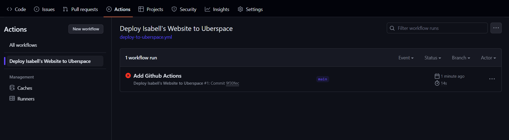
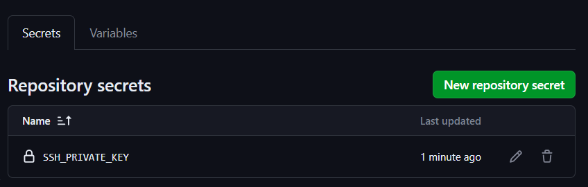
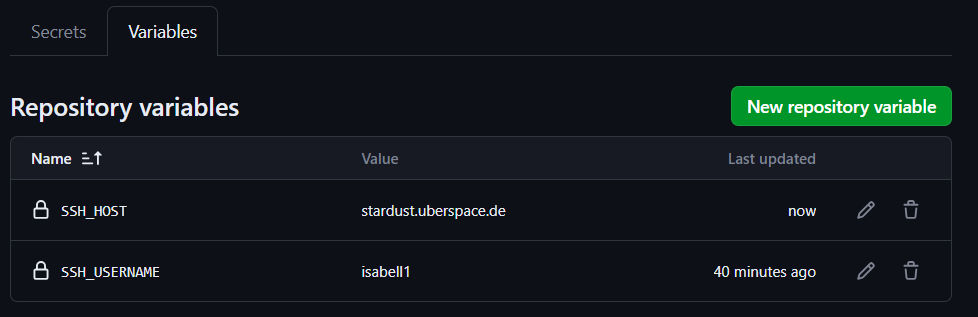
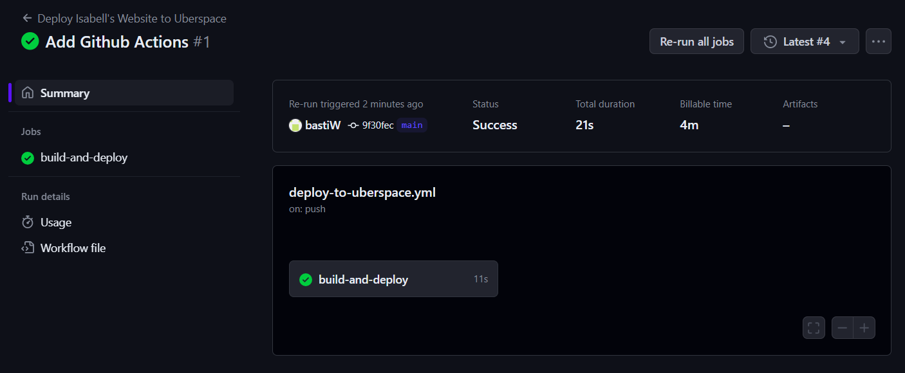

.. highlight:: console
.. author:: Sebastian Weiss <https://sebastianweiss.io>

#######################
Automatic Deployment with CI/CD
#######################

When you develop your own web application it is very useful to deploy your code automatically.
As soon as you push your code to the main branch of your repository or on any other event you can trigger a build pipeline which can run automatic tests, build your code and automatically pushs it to your Uberspace.

In comparison to :lab:`manual deployment <guide_gitea>` automatic deployment can speed up your development process. This process is called CI/CD (Continuous Integration/Continuous Delivery).

.. mermaid::

   ---
    title:
   ---
    flowchart LR
        GitRepository["Git Repository"] -- Build Pipeline --> Uberspace

Build Pipeline
--------------

There are several solutions available to automatically deploy your code to your Uberspace.

- GitHub Actions
- GitLab CI/CD
- Gitea Actions

.. note:: For this guide you should be familiar with the basic concepts of git.

Prerequisites
============
Install or make sure the following command line tools are installed

    - Git
    - Github CLI

Prepare Git Repository
=============
Init a new Git repository `isabells-website`.

.. code-block:: console

    mkdir isabells-website
    cd isabells-website
    git init --initial-branch=main
    gh repo create isabells-website --private --source=.

Add an ``src/index.html`` file to your git repository.

.. code-block:: html

   <html>
    <head>
    </head>
    <body>
     <h1>Hello World</h1>
    </body>
   </html>

Commit your files.

.. code-block:: console

    git add --all
    git commit -m "Init Isabell's Website"

Push the code

.. code-block:: console

    git push --set-upstream origin main

Your code should now be visible in your GitHub repository.

Deploy with GitHub Actions
--------------------------

In this guide, we push the code to the main branch on github.com.
As soon as you push your changes to GitHub the GitHub Action is triggered which then automatically deploys the code to your Uberspace using Rsync.

.. mermaid::

   ---
    title:
   ---
    flowchart LR
        subgraph GitRepository["Git Repository"]
            LocalBranch["Local Git Branch"] -- push --> Remote["Remote Main Branch"]
        end
        subgraph GithubActions["Github Actions"]
            Remote -- triggers on push --> GitHubActionCheckout["Checkout the Branch"] --> GitHubActionRsync["Deploy using Rsync"]
        end
        GitHubActionRsync --> Uberspace

In the next steps we push code to the GitHub Remote Repository, create the Github Action, set the variables and SSH secrets and test the deployment process.

Add Github Action
=================

GitHub Actions are basically YAML files stored within your repository. Those files define the steps which are automatically executed by any action, in our example: "Push to main".

Create ``.github/workflows/deploy-to-uberspace.yml`` within the ``isabells-website`` folder.

.. code-block:: yaml

    name: Deploy Isabell's Website to Uberspace
    on:
      push:
        branches: [main]
    jobs:
      build-and-deploy:
        runs-on: ubuntu-latest
        steps:
          - uses: actions/checkout@v4
          - name: Deploy using Rsync
            uses: burnett01/rsync-deployments@6.0.0
            with:
              switches: -avrh --delete
              path: src/
              remote_path: /var/www/virtual/${{ vars.SSH_USERNAME }}/html
              remote_host: ${{ vars.SSH_HOST }}
              remote_user: ${{ vars.SSH_USERNAME }}
              remote_key: ${{ secrets.SSH_PRIVATE_KEY }}

The `name` is shown in the UI of GitHub Actions to track the process of your deployment.
The `on` is the trigger. In our case `push` to the `main` branch.
The `job` with the name `build-and-deploy` runs on `ubuntu-latest`

It automatically checks out the code to the runner and deploys the code to Uberspace using rsync.

We are using an existing GitHub action called `burnett01/rsync-deployments@6.0.0`:
The `path` is the directory which you want to deploy. In our case it is the folder with the `index.html`, the `src` directory.
The `remote_path` describes where we want to copy our website on the Uberspace.
All `remote_...` params use secrets or variables. Those are set on the GitHub UI.

Push your code changes.

.. code-block:: console

    git add --all
    git commit -m "Add Github Actions"
    git push

You can now see your GitHub Action to run and fail. This is because the variables and secrets are not yet set. This we will do in the next step.

Set secrets and variables
=========================

The integrated secret manager in GitHub allows you to save the SSH-Key, username and hostname.

In your GitHub repository go to:

- Settings
- Secrets and variables
- Actions

Add the variables and secrets. Make sure you store the secrets in the ``Secrets`` tab and variables in the ``Variables`` tab.

.. list-table::
   :widths: 25 25 50
   :header-rows: 1

   * - Type
     - Name
     - Value
   * - Secret
     - SSH_PRIVATE_KEY
     - Your private SSH Key
   * - Variable
     - SSH_USERNAME
     - Your username, don't add any whitespace (e.g. isabell)
   * - Variable
     - SSH_HOST
     - Your hostname, don't add trailing dot `.` or whitespace  (e.g. stardust.uberspace.de)

Re-run job
=======================

After you set the variables you can manually retrigger the process.

In GitHub go to
    - Actions
    - Open the previously failed job
    - Click "Re-run jobs"
    - Click "Re-run all jobs"

Your deployment action should then look like that.

When you now check website you should see the "Hello World" Page.

Run automatically by code push to GitHub
=================

Now it is time to trigger the deployment by a code change.

Open `src/index.html` and replace the content.

.. code-block:: html

    <html>
        <head>
        </head>
        <body>
         <h1>Isabell's Website</h1>
        </body>
    </html>

Push your change to the repository.

.. code-block:: console

    git add --all
    git commit -m "Isabell's Website"
    git push

Check the GitHub Actions again. Wait till it is deployed.

🚀 Congratulations! "Isabell's Website" should now be hosted on your Uberspace.

Debugging
========
In case of errors, check the job. When the error text is not helpful, retrigger the run and check the checkbox "Enable debug logging"

Extend it (optional)
=======

- Some applications require a build step. You can include those steps into the actions before you sync the code via Rsync.
- Use different triggers. Sometimes it is required to trigger your deployment on different triggers. In our guide we are using push to the main branch. You can also modify that behaviour so that you have separate deployments for every branch to a different folder on your Uberspace, or even for every created tag or feature branch.

----
.. author_list::

