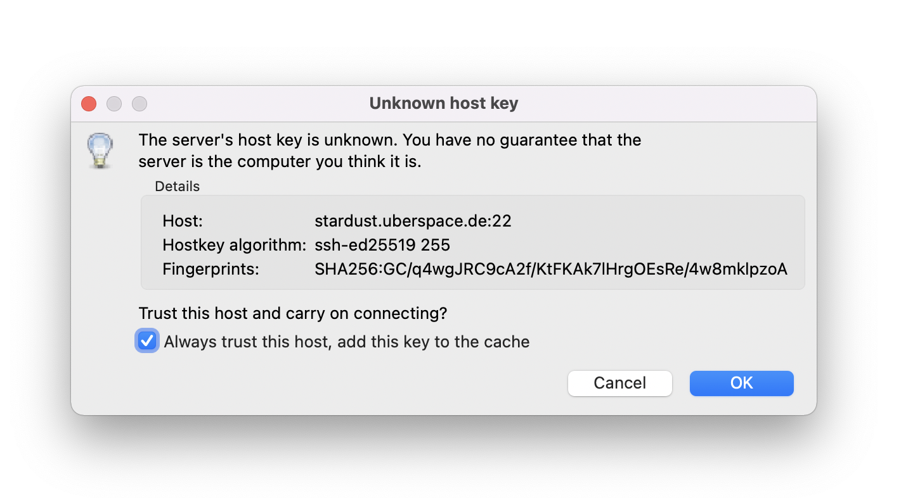
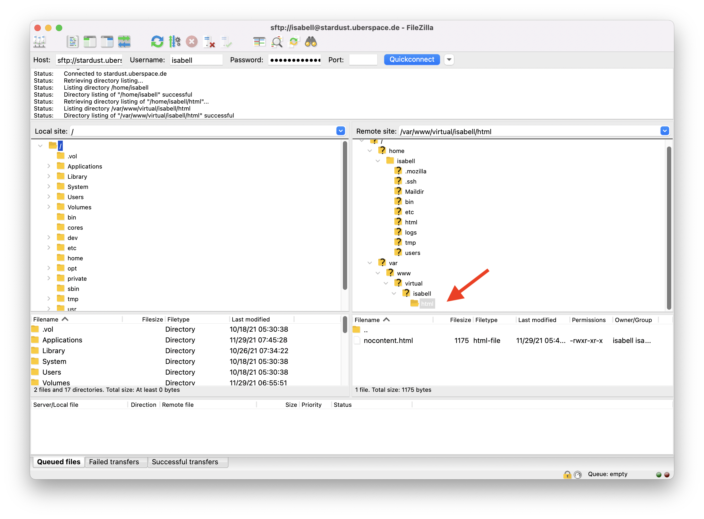
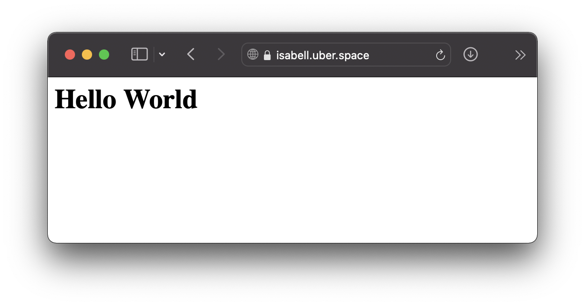

.. highlight:: console

#######################
Create a static website
#######################

You can transfer data to your Asteroid via SFTP protocol, for this you need a SFTP client. We use FileZilla because it is widely used and available for all major platforms and operating systems.

Download and install the version of `FileZilla Client <https://filezilla-project.org/download.php?type=client>`_ for your operating system.

Connect with FileZilla
----------------------

The login data for the connection can be found in the login area at uberspace.de:

* The hostname can be found in `Data sheet <https://dashboard.uberspace.de/dashboard/datasheet>`_
* the username is your account name with Uberspace
* the password can be set at `Logins <https://dashboard.uberspace.de/dashboard/authentication>`_.

.. note:: You need the SSH password, not the password for the web interface. For the port you set 22, the default port for SSH connections.

Check the host key
------------------

When connecting for the first time, you should check the hostkey to make sure that you have reached the correct server. You can find the key in the `datasheet <https://dashboard.uberspace.de/dashboard/datasheet>`_.

Navigate to your DocumentRoot
-----------------------------

When the connection is established, the directory tree of your asteriod is displayed. The DocumentRoot of the web server is located at ``/var/www/virtual/$USER/html``. This is the directory from which the web server delivers your data by default.

Upload index.html
-----------------

As a hands-on exercise, you can create a simple HTML file with the following content and copy it to your DocumentRoot as ``index.html``:

.. code-block:: html

   <html>
    <head>
    </head>
    <body>
     <h1>Hello World</h1>
    </body>
   </html>

If you now access your uber.space domain in your browser you will see the following page:

